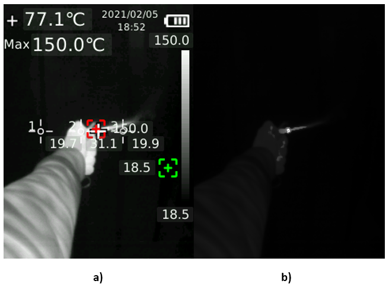
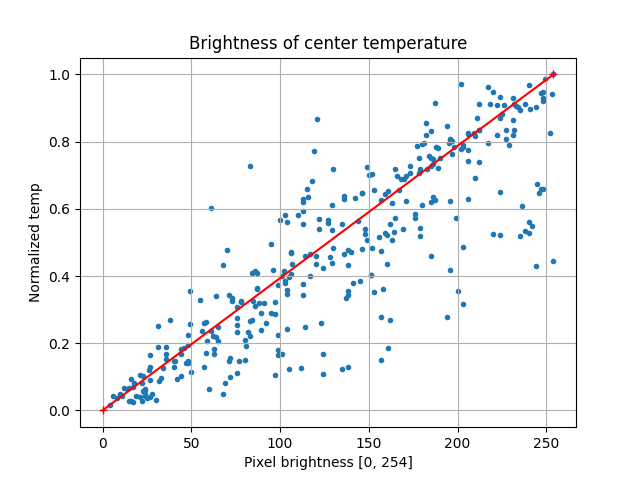
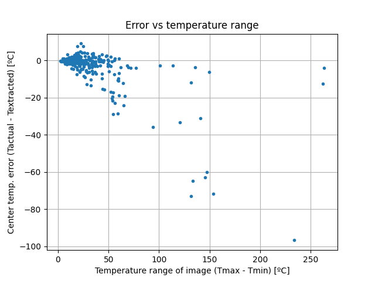
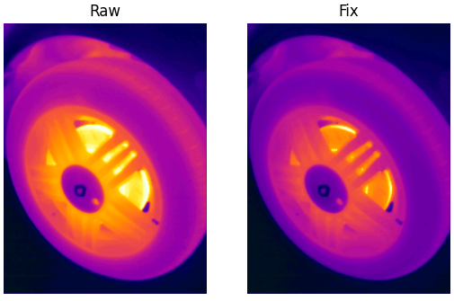
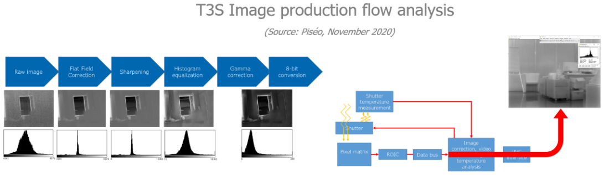

# Temperature extraction issue

Beware, thermal data extracted from the embedded data is not accurate. This issue is present on the UNI-T UTi260B v1.1.2 firmware.

It seems that the raw thermal image is stored already processed to increase its contrast, probably using a histogram equalization before the upscale to 320x240.
As a result the temperature scale becomes non-linear and impossible to characterize.
Therefore, the conversion to real temperatures cannot be properly done, especially if using the expected linear interpolation. 

The following image, a), shows a small handheld blowtorch.
The flame is the hottest point in the picture, reaching 150ºC (Image took with the High Sensitivity setting). 
It can be seen that the flame and hand have almost the same white shade.
However, the temperature of the hand, point 2, is 31ºC, and it should be much much lower on the scale.
So, when converting back the pixel brightness using a linear interpolation between 18.5ºC and 150ºC the result is 142.2ºC, which is clearly wrong.

Image b) shows how the image would look with a proper linear scale. Is easy to understand why UNI-T engineers decided to enhance contrast.
But this is how the data should be stored for posterior analysis, at least in the embedded part.

This issue can be also verified by plotting the center temperature, which is accurate, vs its corresponding pixel brightness (0 to 254).
If the scale were to be linear, the resulting point will lay on the line between the min and max temperatures.
I plotted this for all the pictures I have right now (340). The temperatures were normalized (Tn = (T - Tmin)/(Tmax - Tmin)).
Clearly, the points do not lay as expected, with more error typically in the middle, as is further from the limits.

The higher the temperature range the larger the errors become.
Also, it seems that usually when the range is large the extracted temperatures are higher than it should be.

Right now, at postprocessing using this script or UNI-T software, only high, low and center temperatures can be trusted.
The manual set 3 point measurements are also accurate, but are not stored within the embedded data, so right now cannot be used without image processing.

In order to reduce some temperature error the script now offers a fix version of the img and temperature array that uses a 3 point linear regression, adding the center temperature to the mix.
The effect on the error depends on where the center temperature sits on the temperature scale. If it is close to the minimum or maximum temperatures it won't have much effect.
Anyways, it offers some degree of correction. 

In conclusion, when working with images took from these UNI-T cameras keep in mind that the resulting temperatures could not be exact.
For precise measurements use the built-in camera features.

## Update 06/2021

While searching information about Infiray microbolometers, the brand used on the UTi260B camera, I found an interesting article from a French company.
In this article they analyze how one of this sensors works and generates an image. 

One of the steps is indeed a histogram equalization. 
Although the T3S camera sensor is not the same as the one on the UTi260B, seeing that the final step is converting to 8-bit grayscale just like the stored thermal image in the BMPs makes me think it is the same process for both sensors.

This would confirm that the thermal image is not exactly as accurate as it could be.
The C200 Infiray cameras (That look like a collaboration between Infiray and UNI-T) seem to have overcome this issue by storing raw radiometric data instead of the sensor 8-bit image.

## Ask UNI-T
Please, help us notify this issue to UNI-T. If we could get a firmware update with the radiometric data as the Infiray cameras do the UNI-T cameras will become much more suited for professional work.

support@uni-trend.com.cn